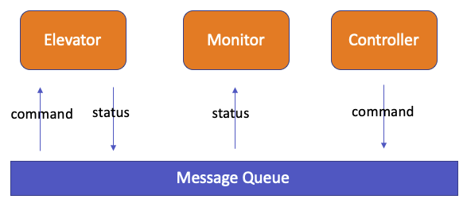
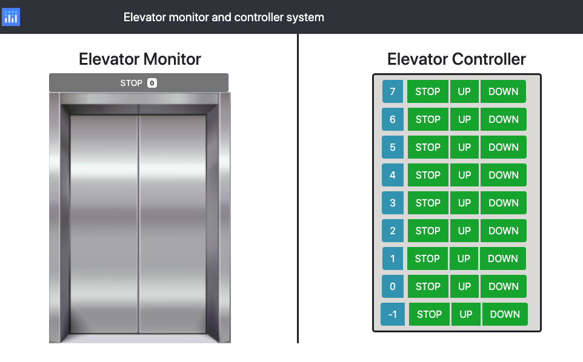
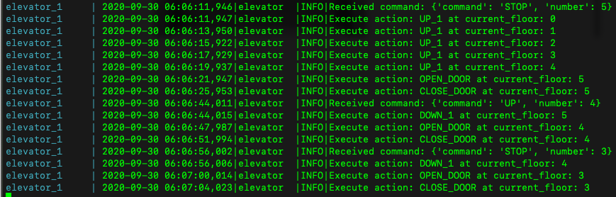

# About Project
This is an elevator simulator project.
Using the microservices architecture to implement it.
There are serval services running to implement the whole system.


## Elevator
The elevator can accept the inside stop request or outside call up or down command, caculate the steps plan and execute it one by one.

The elevator will take 1 second to implement each step.

It can check new command from the message queue online and add it into the current steps plan.

So its steps plan will be dynamically updated according to the new added commands.

## Monitor
The monitor system is used to get the status of the elevator and display it online.

A Dash system is used to display the elevator status in the webpage.

If running in local machine, click the url [http://127.0.0.1:8050/](http://127.0.0.1:8050/) to open it.

## Controller
The Controller can send command to the elevator to control its behaviour. The command can be:

* STOP at specific floor
* CALL UP from specific floor
* CALL DOWN from specific floor

The Controller send command bypass the message queue to the elevator.


## Redis
It build a message connection between the elevator and monitor/controller service.
The elevator can send status to the monitor or get command from the controller from this connection.





# Prerequest
Before run the project,the following things are needed

### Docker
Go to the following URL to install Docker

[Docker install](https://docs.docker.com/docker-for-windows/install/)

### Docker-compose
Go to the following URL to install Docker-compose

[Docker-compose install](https://docs.docker.com/compose/install/)

# Start/Stop the project

## Build
Run the following command to build the project

```bash
make build
```

## Start
Run the following command to start the project

```bash
make start
```

## Stop
```bash
make stop
```

## Tests
Run the unittest by using command
```bash
make test
```

# Operation 
## Open the monitor and controller system

Click the url [http://127.0.0.1:8050/](http://127.0.0.1:8050/) to open it.
You will see a webpage as following:



The left part is the monitor system and the right part is the controller system.

## Input the command
In the Elevator Controller part, the number from -1 to 7 means the floor number.

`STOP` button means request elevator stop at that floor.

`UP` button means request elevator go to the floor to pick up a people who want to go up 

`DOWN` button means request elevator go to the floor to pick up a people who want to go down 

Click any button will send the corroponding command to the elevator.

## Display the status

When the elevator received any command from the controller, it will start to move.

As the elevator moving, the monitor will display the status of elevator online. It will display the status moving action like `STOP`,`UP`,`DOWN` and the floor number.

## Check the logs of the elevator

You can also to see the elevator status from its logs. One example is as following:



If the docker container log is closed, please use the following command to open it.

```bash
make logs
```
